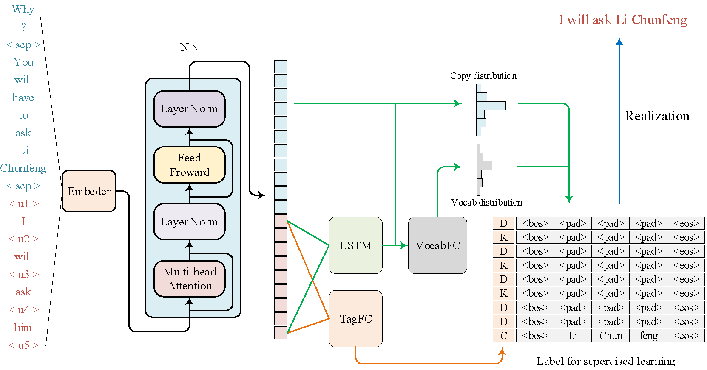

# SARG

This repository is the implementation of [SARG: A Novel Semi Autoregressive Generator for Multi-turn Incomplete Utterance Restoration](https://arxiv.org/abs/2008.01474) in python 3.6 environment and pytorch 1.5.1.



## Requirements

To install requirements:

```setup
pip install -r requirements.txt
```
Note: install the torch-gpu version corresponding to the version of cuda. 

## Pretrained Models
* First, you can first download the pretrained models [RoBERTa-wwm-ext, Chinese](https://github.com/ymcui/Chinese-BERT-wwm) for chinese dataset (rename it `chinese_roberta_wwm_ext_pytorch`) and  [bert-base-uncased](https://huggingface.co/bert-base-uncased/tree/main) for english dataset , 
* Second, rename the `bert_config.json` to `config.json` in `chinese_roberta_wwm_ext_pytorch`.
* Final, convert the BERT pretrained weights to initial weights of SARG by 
```
python covert_weight_from_bert_to_sarg.py.
```


## Training

### Restoration_200k_data
For the model with coverage mechanism, we first optimize the model 14000 steps with no coverage loss and then train it until convergence with coverage loss weighted to .

Our experiments of _Restoration-200k_ are conducted on 7 Tesla P40. To obtain the best performance as reported in paper, we recommend to do this train as below:

```train
sh scripts/run_train_chinese.sh
```
Or if the less GPUs you have, the possible solution is to set the  `gradient_accumulation_steps` to be an appropriate value.

### CANARD

Our experiments of _CANARD_ are conducted on a single GPU. And we also find that the added coverage loss does no help to the overall model. The training is as below:

```train
sh scripts/run_train_english.sh
```

## Evaluation

To evaluate the model on _Restoration-200k_, run:

```eval
sh scripts/run_eval_chinese.sh
```

To evaluate the model on _CANARD_, run:
```eval
sh scripts/run_eval_english.sh
```

## Citation

If you use this code in your research, you can cite our paper.

```
@article{huang2020sarg,
  title={SARG: A Novel Semi Autoregressive Generator for Multi-turn Incomplete Utterance Restoration},
  author={Huang, Mengzuo and Li, Feng and Zou, Wuhe and Zhang, Weidong},
  journal={arXiv preprint arXiv:2008.01474},
  year={2020}
}
```

